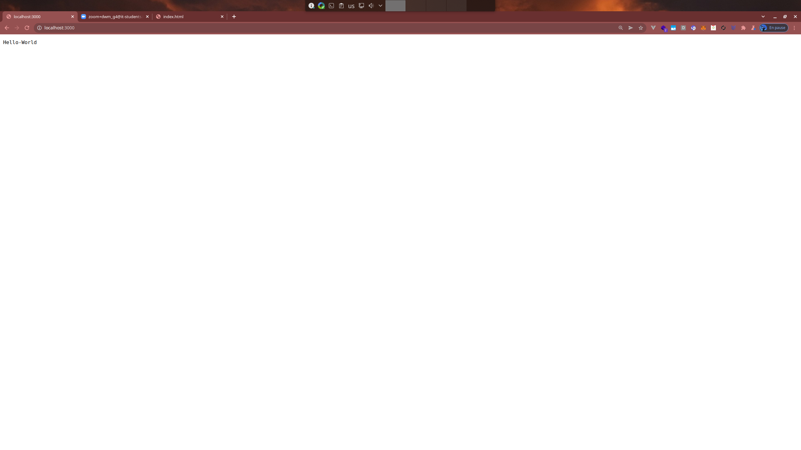
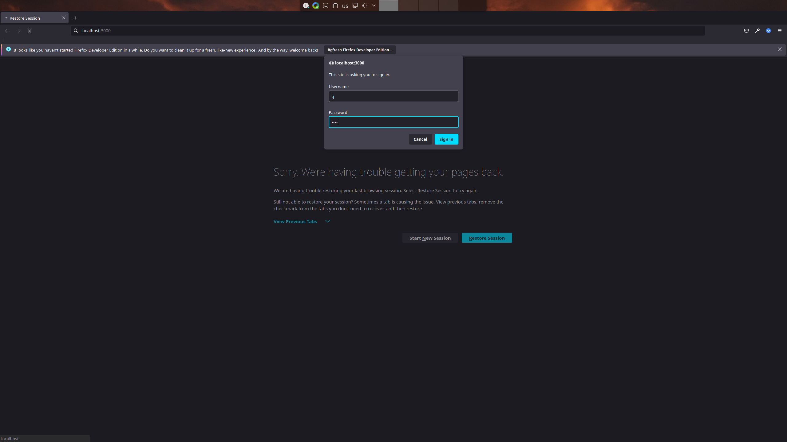
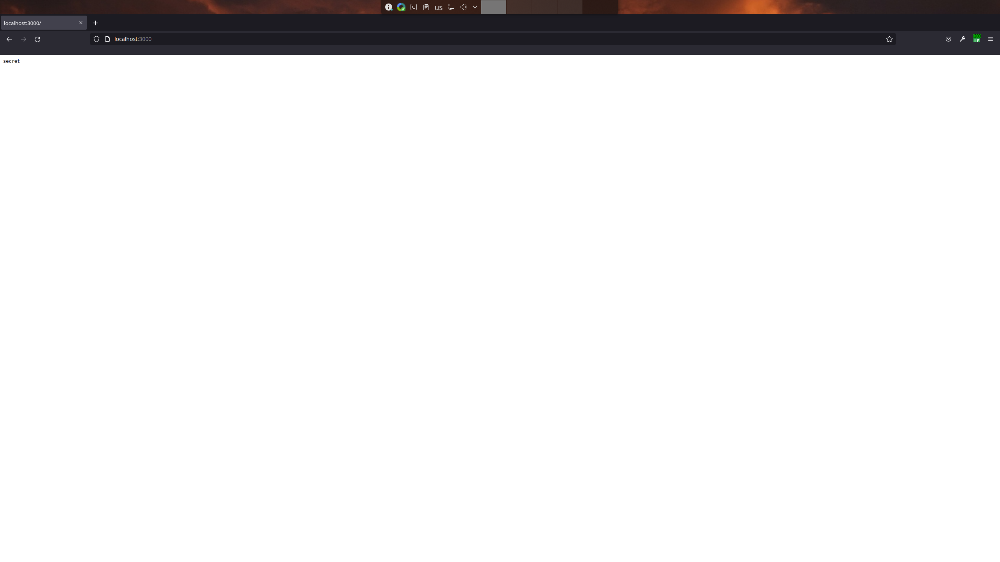
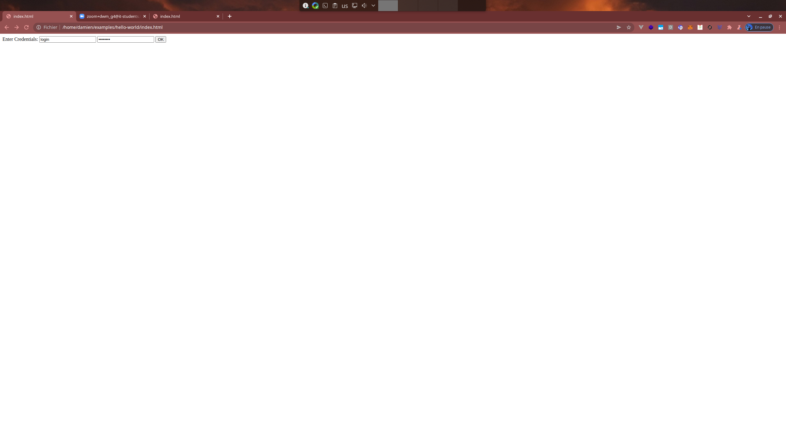
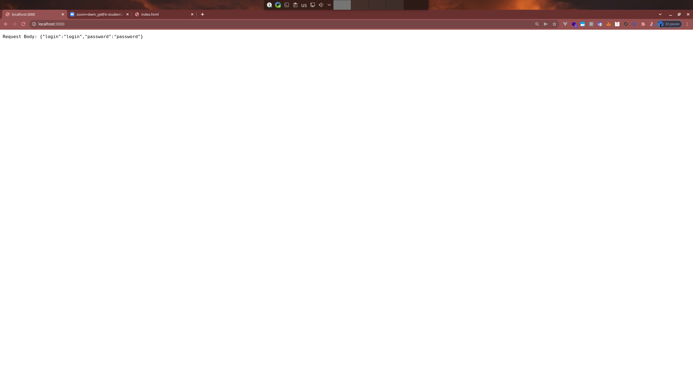

# Ressources :
- https://koajs.com/
- https://www.tutorialspoint.com/koajs/koajs_routing.htm

---

# Installer Node JS 
- https://nodejs.org/en/

---

# Installer VS-Code
- https://code.visualstudio.com/

---

# Ouvrir VS-Code
- Ouvrir le Terminal (Ctrl + J)
- Lancer la commande `node --version`
- Sur windows si vous ne pouvez pas lancer la commande verifier qu'il existe dans `C:\Program Files\nodejs\node.exe`

---

# Cloner le repo d'examples
- git clone https://github.com/koajs/examples.git

---

# Creer un repo personnel
- creer un repo personnel pour le rendu de la semaine 
- envoyer le repo sur mon adresse mail pierredamiendelbreil@gmail.com

---

# Examples

---

## Hello-World
- `cd hello-world`
- `npm install` # installer les paquets necessaires grace a la commande npm (node packages manager)
- `node app.js`
- ouvrir un navigateur et allez sur l'adresse localhost:3000 afin de voir inscrit Hello-World



---

## Basic-Auth
- `cd basic-auth`
- `node app.js`
- ouvrir un navigateur et allez sur l'adresse localhost:3000
- une popup s'affiche et vous demande les credentials stipule dans app.js `app.use(auth({ name: 'tj', pass: 'tobi' }));`
- en rentrant tj et tobi vous acceder a la page 




---

## Hello-World + BodyParser

- creer un fichier app.js 
  - dans lequel vous reprenez l'example hello-world et vous rajouter le paquet koa-body
- creer un fichier html 
  - dans lequel vous ajouterez un form avec deux inputs login + password + button pour envoyer la requete
  - le form fera un POST sur localhost:3000
- lancer lapp `node app.js`
- ouvrir index.html dans votre navigateur, remplissez login plus password puis valider 
- la page affiche reprendra le contenu des inputs + password du fichier html
 
 ### index.html 
 ```html
 <html>
    <form action="http://localhost:3000/" method="post">
      <label for="credentials">Enter Credentials: </label>
      <input id="login" type="text" name="login" value="login">
      <input id="password" type="password" name="password" value="password">
      <input type="submit" value="OK">
    </form>
 </html>
 ```
    
 #### app.js
 ```js
 // require est un mot clef necessaire pour importer un paquet
const Koa = require('koa');
const koaBody = require('koa-body');

// rendre disponbile pour d'autres fichiers l'applicatin koa 
const app = module.exports = new Koa();

// afin de pouvoir recuperer les parametres du POST dans le contexte
app.use(koaBody({ multipart: true }));

// declaration et utilisation d'une fonction qui retournera les elements du body
app.use(async function(ctx) {
  ctx.body = `Request Body: ${JSON.stringify(ctx.request.body)}`;
});

// demarrer l'application
if (!module.parent) app.listen(3000);
```




---

### Initiliaser un projet node

- `npm init`
    - remplir les differents champs

### Ajouter des paquets au projet

- `npm install koa koa-router koa-body`
- rajouter un champ `start` dans la partie scripts de package.json

```
"scripts": {
  "test": "echo \"Error: no test specified\" && exit 1",
  "start": "node app.js"
}
```

### Demarrer l'application

- `npm start` # vu que l'on as declarer un script de demmarage on peux l'executer en utilisant npm start
- si l'on regarde a quoi il correspond cela reviens a faire : `node app.js`
